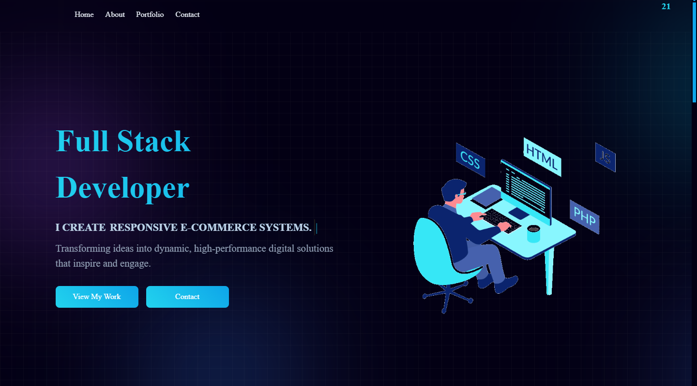

## **Seif Soliman's Portfolio Website**  
🚀 **A personal portfolio showcasing my projects, skills, and achievements.**  

  

### **📌 Overview**  
This is my personal portfolio website, designed to highlight my work as a **Full Stack Developer**. It features a modern UI, responsive design, and smooth animations to create an engaging and interactive experience.  

### **🔧 Technologies Used**  
- **HTML5** - Structured and semantic markup  
- **CSS3** - Custom styles with responsive design  
- **JavaScript** - Interactive elements and animations  
- **FontAwesome** - Icons for better UI experience  
- **Git & GitHub** - Version control and project hosting  

### **📂 Project Structure**  
```
/portfolio-website
│── /img                # Images and assets
│── styles.css          # Stylesheet
│── script.js           # JavaScript file
│── index.html          # Main homepage
│── README.md           # Project documentation
```

### **🎨 Features**  
✅ Fully responsive design  
✅ Dynamic typing effect for introduction  
✅ Interactive project showcase with modal view  
✅ Certificates section  
✅ Tech Stack section  
✅ Contact form with email submission  
✅ Social media links  

### **🚀 Installation & Usage**  
1. Clone the repository:  
   ```sh
   git clone https://github.com/byseif21/portfolio-website.git
   ```
2. Open `index.html` in your browser.  
3. Customize the content as needed.  

### **📜 License & Attribution**  
You're welcome to explore, modify, or build upon this project for personal use. If you decide to use or adapt a significant portion of the code, **a credit or acknowledgment would be appreciated**.  

Ways to give credit:  
- Mentioning **Seif Soliman (byseif21)** in your project's README or footer.   
- Giving a shoutout on GitHub or social media.  

Your support means a lot, and I'd love to see how you customize it! 😊  

### **💡 Credits**  
- Design inspired by [EkiZR](https://github.com/EkiZR)
- Icons by [FontAwesome](https://fontawesome.com)  
- Hosted on **GitHub Pages**  

### **📩 Contact**  
💻 Visit my portfolio: [seifsoliman.com](https://seifsoliman.netlify.app/)  
📍 Contact me: [LinkedIn](https://www.linkedin.com/in/-seif-soliman/)  
👨‍💻 GitHub: [@byseif21](https://github.com/byseif21)  
 
