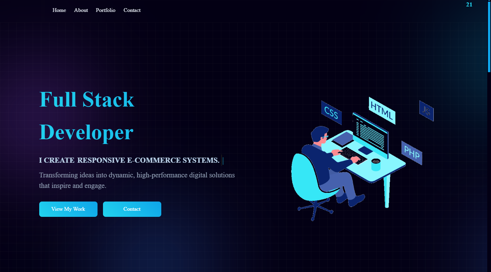

## **Seif Soliman's Portfolio Website**

**A personal portfolio showcasing my projects, skills, and achievements.**



### **📌 Overview**

This is my personal portfolio website, designed to highlight my work as a **Full Stack Developer**. It features a modern UI, responsive design, and smooth animations to create an engaging and interactive experience. Built with Vite for fast development and optimized production builds.

### **🔧 Technologies Used**

- **HTML5** – Semantic, accessible markup
- **CSS3** – Responsive, modern UI
- **JavaScript (ES Modules)** – Interactive logic and animations
- **Vite** – Dev server and build tooling
- **PostCSS + Autoprefixer** – Cross-browser CSS
- **ESLint + Prettier + Husky** – Code quality and formatting
- **Font Awesome (CDN)** – Iconography
- **@fontsource/poppins** – Typography
- **Netlify Forms** – Contact form handling
- **Git & GitHub** – Version control and hosting

### **📂 Project Structure**

```
my-final-portfolio-website
├── public/
│   ├── data/                # JSON data (projects, certificates, tech stack)
│   └── img/                 # Images and assets
├── index.html               # Main page
├── script.js                # App logic (fetch + render)
├── styles.css               # Styles
├── cv.html / cv.css / cv.js # CV page
├── package.json             # Scripts and tooling
├── vite.config.js           # Vite configuration
└── README.md                # Project documentation
```

### **🎨 Features**

✔️ Fully responsive design  
✔️ Dynamic typing effect for introduction  
✔️ Interactive project showcase with modal view  
✔️ Certificates section  
✔️ Tech Stack section  
✔️ Contact form powered by Netlify Forms  
✔️ Social media links

### **🛠️ Installation & Usage**

1. Clone the repository:
   ```sh
   git clone https://github.com/byseif21/portfolio-website.git
   ```
2. Install dependencies and start the dev server:
   ```sh
   npm install
   npm run dev
   ```
3. Build for production (optional) and preview locally:
   ```sh
   npm run build
   npm run preview
   ```

### **📜 License & Attribution**

You're welcome to explore, modify, or build upon this project for personal use. If you decide to use or adapt a significant portion of the code, **a credit or acknowledgment would be appreciated**.

Ways to give credit:

- Mentioning **Seif Soliman (byseif21)** in your project's README or footer.
- Giving a shoutout on GitHub or social media.

Your support means a lot, and I'd love to see how you customize it! 😊

### **💡 Credits**

- Design inspired by [EkiZR](https://github.com/EkiZR)
- Icons by [FontAwesome](https://fontawesome.com)
- Deployed on **Netlify**

### **📩 Contact**

🌐 Visit my portfolio: [seifsoliman.com](https://seifsoliman.netlify.app/)  
📍 Contact me: [LinkedIn](https://www.linkedin.com/in/-seif-soliman/)  
👨‍💻 GitHub: [@byseif21](https://github.com/byseif21)
